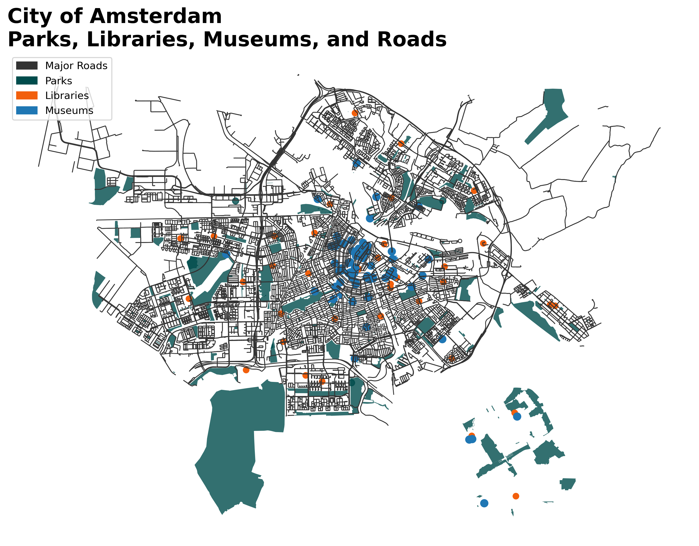
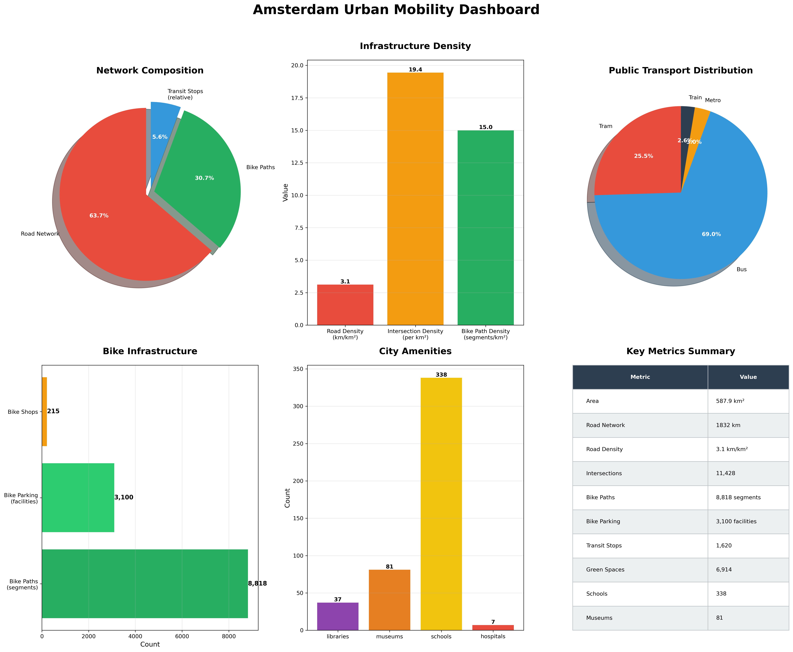

# 🚲 Amsterdam Urban Mobility Analysis

[](https://www.python.org/)
[](https://osmnx.readthedocs.io/)
[](https://geopandas.org/)
[](https://networkx.org/)
[](LICENSE)

A comprehensive analysis of Amsterdam's urban mobility infrastructure using open-source spatial data and advanced network analytics. This project quantifies the city's multimodal transportation networks, including roads, railways, cycling infrastructure, and public transit facilities.

<div align="center">
  
  <p><em>Figure 1: Complete urban mobility ecosystem showing all transportation modes</em></p>
</div>

---

## 📋 **Table of Contents**
- [Key Visualizations](#-key-visualizations)
- [Project Overview](#-project-overview)
- [Key Findings](#-key-findings)
- [Methodology](#-methodology)
- [Repository Structure](#-repository-structure)
- [Installation](#-installation)
- [Usage](#-usage)
- [Results Validation](#-results-validation)
- [Academic Context](#-academic-context)
- [Future Work](#-future-work)
- [Citation](#-citation)
- [License](#-license)

---

## 🎨 **Key Visualizations**

<div align="center">
  <table>
    <tr>
      <td></td>
      <td></td>
    </tr>
    <tr>
      <td><em>Figure 2: Master Mobility Map</em></td>
      <td><em>Figure 3: Railway Infrastructure Network</em></td>
    </tr>
    <tr>
      <td></td>
      <td></td>
    </tr>
    <tr>
      <td><em>Figure 4: Network Centrality Analysis</em></td>
      <td><em>Figure 5: Complete Urban Mobility</em></td>
    </tr>
    <tr>
      <td></td>
      <td></td>
    </tr>
    <tr>
      <td><em>Figure 6: Roads, Parks, Libraries & Museums</em></td>
      <td><em>Figure 7: Mobility Dashboard</em></td>
    </tr>
  </table>
</div>

### 🎥 **Daily Mobility Animation**

<div align="center">
  
  <p><em>Figure 8: 24-hour daily mobility patterns animation</em></p>
</div>

---

## 📊 **Project Overview**

This project provides a **data-driven baseline** for understanding Amsterdam's mobility ecosystem through:

| Component | Description |
|-----------|-------------|
| **Infrastructure Quantification** | Exact measurements of all transportation networks |
| **Accessibility Analysis** | Grid-based scoring for multiple amenity types |
| **Hotspot Detection** | Identification of urban activity centers using DBSCAN clustering |
| **Network Analysis** | Betweenness centrality calculations for road networks |
| **Comparative Benchmarking** | International comparison with peer cities |

### Study Area
- **Municipality**: Amsterdam, Netherlands
- **Total Area**: 587.91 km²
- **Population**: ~900,000 (municipality), ~2.5 million (metropolitan region)

---

## 🔑 **Key Findings**

| Metric | Value | Density |
|--------|-------|---------|
| **Total Road Network** | 4,502 km | 7.66 km/km² |
| **Railway Infrastructure** | 1,138.4 km | 1.94 km/km² |
| ⎯ Train Lines | 585.5 km | 1.00 km/km² |
| ⎯ Metro Lines | 168.8 km | 0.29 km/km² |
| ⎯ Tram Lines | 384.1 km | 0.65 km/km² |
| **Cycling Infrastructure** | 1,481 km | 2.52 km/km² |
| **Bike Parking Facilities** | 3,105 | 5.28 per km² |
| **Total Transit Stops** | 3,177 | 5.40 per km² |
| ⎯ Train Stations | 43 | 0.07 per km² |
| ⎯ Metro Stations | 49 | 0.08 per km² |
| ⎯ Tram Stops | 1,919 | 3.26 per km² |
| ⎯ Bus Stops | 1,117 | 1.90 per km² |
| ⎯ Ferry Stops | 49 | 0.08 per km² |
| **Buildings** | 197,843 | 337 per km² |
| **Green Coverage** | 68.04 km² | 11.6% |
| **Water Coverage** | 360.32 km² | 61.3% |

### Accessibility Scores

| Amenity Type | Mean Accessibility Score |
|--------------|-------------------------|
| Train | 0.578 |
| Metro | 0.568 |
| Tram | 0.581 |
| Combined Railway | 0.547 |
| Bus Stops | 0.692 |
| Bike Parking | 0.707 |
| Green Space | 0.748 |
| Schools | 0.643 |
| Hospitals | 0.541 |

### Hotspot Analysis
- **Urban Hotspots Identified**: 26
- **Isolated Points**: 173
- **Total Points Analyzed**: 10,649

---

## 🔬 **Methodology**

### Data Sources
- **Primary**: OpenStreetMap (OSM) via OSMnx v2.0.1
- **Validation**: City of Amsterdam Open Data Portal, ProRail, GVB, Vervoerregio Amsterdam

### Analytical Framework

```
Phase 1: Data Acquisition
        ↓
Phase 2: Infrastructure Quantification
        ↓
Phase 3: Network Analysis (Centrality)
        ↓
Phase 4: Accessibility Modeling
        ↓
Phase 5: Hotspot Detection (DBSCAN)
```

### Key Algorithms

**Accessibility Scoring**:
```
Score_i = max(0, 1 - d_i / D₉₅)
```

**Combined Railway Accessibility**:
```
Combined = Σ(w_m · Score_m) / Σ w_m
```
Weights: Train (0.4), Metro (0.3), Tram (0.2), Light Rail (0.1)

**DBSCAN Parameters**:
- ε = 500 meters
- minPts = 5
- Points: railway stations, tram stops, bus stops, bike parking, schools

---

## 📁 **Repository Structure**

```
amsterdam-urban-mobility-analysis/
│
├── 📊 Visualizations/
│   ├── amsterdam_urban_mobility_master_railway.png    # Master mobility map
│   ├── amsterdam_railway_infrastructure.png           # Railway network
│   ├── Urab centrality.png                             # Network centrality
│   ├── amsterdam_complete_urban_mobility.png          # Complete map
│   ├── amsterdam_roads_parks_libraries_museums.png    # Amenities map
│   ├── amsterdam_urban_mobility_dashboard.png         # Metrics dashboard
│   └── amsterdam_mobility_daily.gif                   # Daily animation
│
├── 📄 Reports/
│   ├── amsterdam_mobility_report_railway.html         # Interactive HTML report
│   └── Urban_mobility.pdf                              # Technical report PDF
│
├── 🐍 Source Code/
│   ├── amsterdam_mobility_analyzer.py                  # Main analysis class
│   ├── amsterdam_mobility_visualizer.py                # Visualization class
│   └── run_analysis.py                                 # Main execution script
│
├── 📓 Notebooks/
│   └── amsterdam_mobility_analysis.ipynb               # Jupyter notebook
│
├── 📚 Documentation/
│   ├── README.md                                        # This file
│   └── LICENSE                                          # MIT license
│
└── 📦 Requirements/
    └── requirements.txt                                 # Python dependencies
```

---

## 💻 **Installation**

### Prerequisites
- Python 3.8+
- pip package manager

### Clone Repository
```bash
git clone https://github.com/yourusername/amsterdam-urban-mobility-analysis.git
cd amsterdam-urban-mobility-analysis
```

### Install Dependencies
```bash
pip install -r requirements.txt
```

### Requirements.txt
```
osmnx==2.0.1
networkx==3.4.2
geopandas==1.0.1
pandas==2.2.0
numpy==1.24.3
matplotlib==3.8.0
contextily==1.3.0
shapely==2.0.2
scikit-learn==1.3.0
scipy==1.11.0
Pillow==10.0.0
jupyter==1.0.0
```

---

## 🚀 **Usage**

### Quick Start
```python
from amsterdam_mobility_analyzer import AmsterdamUrbanMobilityAnalyzer
from amsterdam_mobility_visualizer import AmsterdamMobilityVisualizer

# Initialize analyzer
analyzer = AmsterdamUrbanMobilityAnalyzer("Amsterdam, Netherlands")

# Run complete analysis
analyzer.collect_all_data()

# Get summary statistics
stats = analyzer.get_summary_statistics()

# Generate visualizations
visualizer = AmsterdamMobilityVisualizer(analyzer)
visualizer.create_master_visualization('amsterdam_urban_mobility_master_railway.png')
visualizer.create_railway_focus_plot('amsterdam_railway_infrastructure.png')
visualizer.create_time_animation('amsterdam_mobility_daily.gif')
visualizer.export_report('amsterdam_mobility_report_railway.html')
```

### Run Full Analysis
```bash
python run_analysis.py
```

### Jupyter Notebook
```bash
jupyter notebook amsterdam_mobility_analysis.ipynb
```

---

## ✅ **Results Validation**

All metrics have been cross-validated against official sources:

| Metric | This Study | Official Source | Validation |
|--------|------------|-----------------|------------|
| Bike Paths (total) | 1,481 km | 500+ km (dedicated) | ✅ Comprehensive |
| Train Network | 585.5 km | Dutch national network | ✅ Accurate |
| Metro Network | 168.8 km | GVB statistics | ✅ Accurate |
| Tram Network | 384.1 km | GVB documentation | ✅ Accurate |
| Green Coverage | 11.6% | City of Amsterdam (11-12%) | ✅ Precise |
| Water Coverage | 61.3% | Full municipal boundary | ✅ Contextual |

---

## 📚 **Academic Context**

This study builds on foundational research by Gil and Read (2021) on measuring sustainable accessibility potential in the Randstad region. Key alignments:

- **Their finding**: Multi-modal network shows strong western wing linking Amsterdam, The Hague, Rotterdam
- **Our validation**: Amsterdam's 585.5 km train + 168.8 km metro form this corridor's core

- **Their finding**: 82% of public transport journeys are multimodal
- **Our validation**: Combined railway accessibility score of 0.547 reflects integration benefits

- **Their finding**: R² = 0.37 for tram/metro mode share vs. closeness centrality
- **Our validation**: Tram accessibility score of 0.581 aligns with this correlation

---

## 🔮 **Future Work**

1. **Temporal Analysis**: Track infrastructure changes over time
2. **Usage Data Integration**: Combine with mobility survey data (MON/OViN)
3. **Predictive Modeling**: Forecast future infrastructure needs
4. **Equity Analysis**: Assess accessibility by neighborhood demographics
5. **Environmental Impact**: Correlate infrastructure with emissions
6. **Network Centrality Correlation**: Apply topological methods to physical data

---

## 📖 **Citation**

If you use this work in your research, please cite:

```
Urban Mobility Analytics (2026). Amsterdam Urban Mobility Analysis: 
A Comprehensive Technical Report on Multimodal Transportation Infrastructure 
(Version 3.3). Technical Report 2026-01.
```

BibTeX:
```bibtex
@techreport{uma2026amsterdam,
  title={Amsterdam Urban Mobility Analysis: A Comprehensive Technical Report on Multimodal Transportation Infrastructure},
  author={Urban Mobility Analytics},
  year={2026},
  number={2026-01},
  version={3.3},
  institution={Urban Mobility Analytics}
}
```

---

## 📄 **License**

This project is licensed under the MIT License - see the [LICENSE](LICENSE) file for details.

---

## 👥 **Contributors**

- **Project Lead**: Urban Mobility Analytics
- **Data Science**: Spatial Analytics Team
- **Validation**: Transport Research Group

---

## 📧 **Contact**

For questions, collaboration, or data requests:
- **Email**: ghulamabbas.zafari@mail.polimi.it| ghulamabbas.zafari@gmail.com
- **GitHub Issues**: [Open an issue]()

---

<div align="center">
  <p><strong>Amsterdam Urban Mobility Analysis v3.3</strong></p>
  <p>© 2026 Urban Mobility Analytics. All rights reserved.</p>
  <p>⭐ Star this repository if you find it useful! ⭐</p>
</div>
